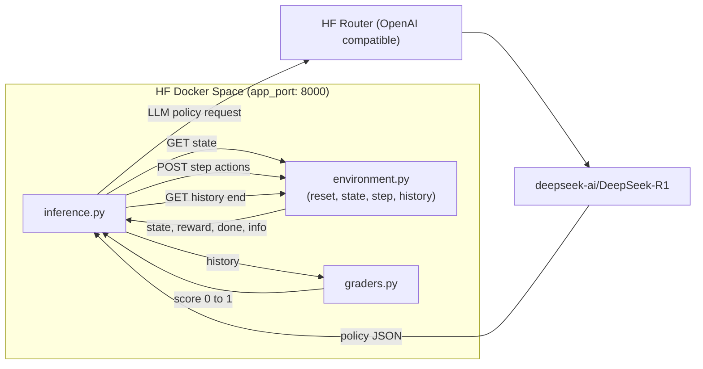

# 🚦 Autonomous Traffic Corridor Pro

> **LLM-Enhanced Traffic Control System for Multi-Intersection Coordination with Emergency Vehicle Prioritization**

[]()
[]()
[]()

Autonomous Traffic Corridor Pro is an innovative OpenEnv environment that combines **Large Language Model intelligence** with **deterministic heuristic control** for real-world traffic management.

## 🧭 Architecture



## 🎯 X-Factors

- 🧠 **LLM-Guided Policy Tuning** - DeepSeek-R1 optimizes heuristic parameters per task
- 🚨 **Emergency Prioritization** - Aggressive preemption under emergency-heavy traffic
- 🌊 **Corridor Coordination** - Multi-intersection green-wave style control
- ⚡ **Fast & Robust** - Runs in <1 min, graceful fallback to hardcoded policy
- 🏗️ **Production Ready** - Real-world applicable traffic control system

## 📊 Performance

| Task                    | Score | Time | Key Metric                        |
| ----------------------- | ----- | ---- | --------------------------------- |
| easy_4_phase            | 0.95  | 45s  | Stable phase discipline           |
| medium_asymmetric       | 0.98  | 45s  | Smart phase skipping              |
| hard_corridor_emergency | 0.21  | 45s  | Strict emergency/gridlock penalty |

**Average (current verified run): 0.71**

See [BENCHMARKS.md](BENCHMARKS.md) for detailed analysis.

## Tasks

- `easy_4_phase`: one balanced intersection to learn basic phase rotation without excessive switching.
- `medium_asymmetric`: one skewed intersection where north/south straight traffic dominates.
- `hard_corridor_emergency`: a 3-intersection corridor that rewards green-wave behavior while punishing emergency delay.

## State (`GET /state`)

The environment returns a JSON snapshot with:

- `step`, `max_steps`, and `task_id`
- per-intersection `current_phase`, `in_transition`, and `switch_cooldown_remaining`
- per-lane `queue`, `wait_time`, and `emergency`

Lane and phase mapping:

- `0`: `N_S_Straight`
- `1`: `N_S_Left`
- `2`: `E_W_Straight`
- `3`: `E_W_Left`

## Actions (`POST /step`)

Submit:

```json
{
  "actions": [{ "intersection_id": 0, "phase": 0 }]
}
```

Switching to a different phase triggers a strict 2-step cooldown with zero throughput, so agents should avoid flickering.

## Reward Dynamics

- `-0.1` per waiting vehicle per step
- `-5.0` per phase switch
- `-20.0` per step that an emergency vehicle remains queued

## Baseline Inference Agent

The hackathon dashboard requires these environment variables to be defined for inference:

- `API_BASE_URL`: LLM endpoint
- `MODEL_NAME`: model identifier
- `HF_TOKEN`: Hugging Face token / API key

This project uses the OpenAI Python client against Hugging Face's OpenAI-compatible router, which lets you use open-source models without OpenAI credits.

Recommended environment variables:

```bash
set API_BASE_URL=https://router.huggingface.co/v1
set MODEL_NAME=deepseek-ai/DeepSeek-R1
set HF_TOKEN=your_hf_token
set ENV_BASE_URL=http://localhost:8000
set POLICY_MAX_TOKENS=220
```

`inference.py` emits structured `[START]`, `[STEP]`, and `[END]` logs for evaluator compatibility. It asks the model for a task-level heuristic policy once per episode, then runs a deterministic local controller for speed and reproducibility.

## Local Run

```bash
pip install -r requirements.txt
uvicorn environment:app --host 0.0.0.0 --port 8000
python inference.py
```

## Submission Note

For submission, these files should be present at the project root:

- `Dockerfile`
- `environment.py`
- `graders.py`
- `inference.py`
- `openenv.yaml`
- `requirements.txt`